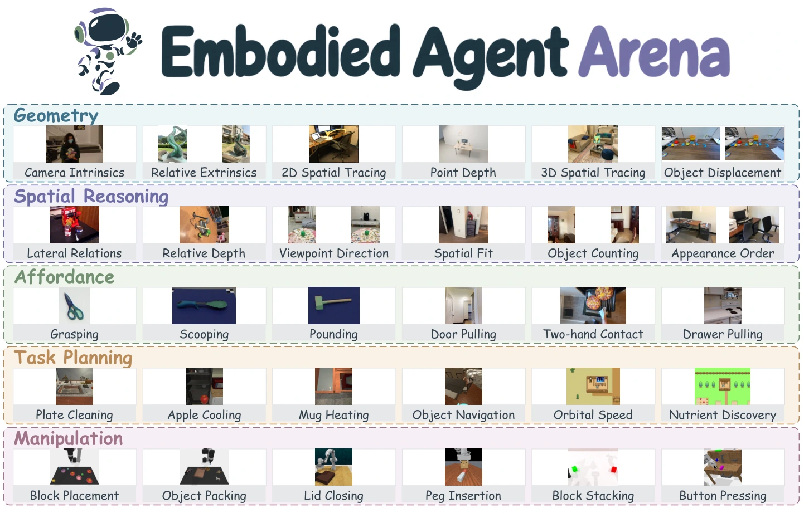

<h1 align="center">
  &nbsp; Embodied Agent Arena
</h1>

<h3 align="center">
  Are Frontier VLM Agents Ready to Be Robot Generalists?<br>
  <em>An Empirical Study with the Embodied Agent Arena</em>
</h3>

<p align="center">
  <a href="https://embodied-agent-arena.github.io/embodied-agent-arena/"></a>
  &nbsp;
  <a href="https://embodied-agent-arena.github.io/embodied-agent-arena/paper.pdf"></a>
  &nbsp;
  <a href="https://huggingface.co/datasets/uuu-Quant/Embodied-Agent-Arena"></a>
</p>

<div align="center">

<p>
Haojian Huang<sup>1,3</sup> · Pukun Zhao<sup>3</sup> · Zexi Li<sup>2,3</sup> · Yehang Zhang<sup>1,3</sup> · Yangkai Wei<sup>3</sup><br>
Wenqian Li<sup>3</sup> · Han Yang<sup>3</sup> · Kaiwen Zhou<sup>3</sup> · Ying-Cong Chen<sup>1,3,†</sup> · Yinchuan Li<sup>3,†</sup>
</p>

<p><sup>1</sup> HKUST (Guangzhou) &nbsp; <sup>2</sup> The Chinese University of Hong Kong &nbsp; <sup>3</sup> Knowin AI<br>
<sup>†</sup> Corresponding authors</p>

</div>

---

## News

- **2026.10.01** — The [paper](https://embodied-agent-arena.github.io/embodied-agent-arena/paper.pdf) and [project page](https://embodied-agent-arena.github.io/embodied-agent-arena/) are available. The manuscript has been submitted to arXiv.
- **2026.10.01** — Released the [evaluation harness](#quick-start), multi-model batch runner, and [1,000-case dataset](https://huggingface.co/datasets/uuu-Quant/Embodied-Agent-Arena).

## Milestones

- [x] **Paper and project page** — Study, results, and case studies.
- [x] **Evaluation code** — Agent harness, benchmark adapters, scoring, and installation guides.
- [x] **Benchmark data** — 1,000-case dataset with a pinned download revision.
- [ ] **Reproduction reports** — Per-model evaluation outputs and consolidated analysis reports.
- [ ] **Analysis tools** — Scripts for aggregating results and reproducing the paper's figures.

## Overview

Embodied Agent Arena evaluates seven frontier vision-language agents on **1,000 cases** across five robotic capabilities. It combines 32 established sources with **GeoProbe**, a new 168-case geometric-estimation benchmark. A unified agent harness connects model-generated programs to source environments, and task-level analyses examine how perception, reasoning, and intermediate actions translate into complete robotic tasks.



## 📦 Benchmark

**GeoProbe** evaluates camera motion, object displacement, depth, and scale. Controlled Blender scenes isolate these geometric factors; real images extend the evaluation to natural scenes.

| Track | Cases | What the agent must do |
| :--- | ---: | :--- |
| **W1 Geometry** | 370 | Estimate camera parameters, depth, motion, and scale; trace spatial paths. |
| **W2 Spatial Reasoning** | 220 | Relate objects and viewpoints, compare distances, and reason about scene layout. |
| **W3 Task Planning** | 157 | Coordinate actions and feedback to satisfy household and scientific goals. |
| **W4 Manipulation** | 183 | Execute placement, insertion, articulation, and sequential control tasks. |
| **W5 Affordance** | 70 | Locate usable contacts and functional regions for an intended action. |

## 📊 Results

- **Estimation, contact grounding, and planning.** Astra has the lowest error on all five controlled Blender estimation targets, leads valid-contact prediction on UMD and ReasonAff, and leads or ties the best model across all six planning sources.
- **Spatial reference frames.** Astra excels at connecting views, while inferring camera movement and object-facing directions exposes different weaknesses.
- **Progress and task completion.** Accurate traces and longer action sequences can still miss required endpoints or final goals. Household manipulation additionally demands coordinated navigation, object handling, and environment-state changes.

See the [project page](https://embodied-agent-arena.github.io/embodied-agent-arena/#findings) for comparisons and case studies, and the [paper](https://embodied-agent-arena.github.io/embodied-agent-arena/paper.pdf) for evaluation protocols and full results.

## Quick Start

### 1. Install

Use Linux and Python 3.10 or newer. From the repository root:

```bash
python3 -m venv .venv
source .venv/bin/activate
python -m pip install -e '.[offline,test,hub]'
```

For Task Planning and Manipulation, also follow the [interactive environment installation guide](docs/INSTALL.md) for the benchmarks you want to run.

### 2. Download the dataset

Download the [Hugging Face dataset](https://huggingface.co/datasets/uuu-Quant/Embodied-Agent-Arena) at its fixed release revision and validate it:

```bash
python scripts/fetch_data.py \
  --repo-id uuu-Quant/Embodied-Agent-Arena \
  --revision 5f729375eb35163a024625dd8ea72ac57a427a24 \
  --output ../data
arena validate --data-root ../data --hashes
arena list --data-root ../data
```

### 3. Run an evaluation

Copy [.env.example](.env.example) to `.env` and fill in your credentials. Replace `MODEL_ID` with your API model ID:

```bash
arena run --data-root ../data --benchmark w1_vlm_depth -- \
  --provider openai-compatible --model MODEL_ID --env-file .env \
  --workers 1 --retry-http --max-http-rounds 3 --output-dir outputs/evaluation
```

Select tasks with `--wave`, `--benchmark`, or `--case`. Add `--dry-run` to inspect the plan; repeat the command to resume its checkpoint. GPU environments require device and memory settings described in the [installation guide](docs/INSTALL.md).

For **multiple models**, edit [configs/batch.example.json](configs/batch.example.json), then run:

```bash
arena batch --config configs/batch.example.json --output-dir outputs/batch --execute
```

To **score saved offline predictions**, provide JSONL records with `task_id` and `answer` fields:

```bash
arena score --data-root ../data --benchmark w5_umd \
  --predictions predictions.jsonl --output outputs/scores.jsonl
```

## 📖 Citation

If this work is useful for your research, please cite:

```bibtex
@misc{huang2026embodiedagentarena,
  title  = {Are Frontier VLM Agents Ready to Be Robot Generalists?
            An Empirical Study with the Embodied Agent Arena},
  author = {Huang, Haojian and Zhao, Pukun and Li, Zexi and Zhang, Yehang
            and Wei, Yangkai and Li, Wenqian and Yang, Han and Zhou, Kaiwen
            and Chen, Ying-Cong and Li, Yinchuan},
  year   = {2026},
  url    = {https://github.com/embodied-agent-arena/embodied-agent-arena}
}
```
