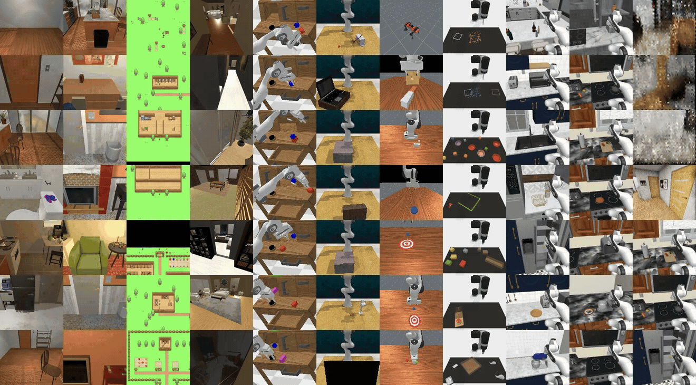
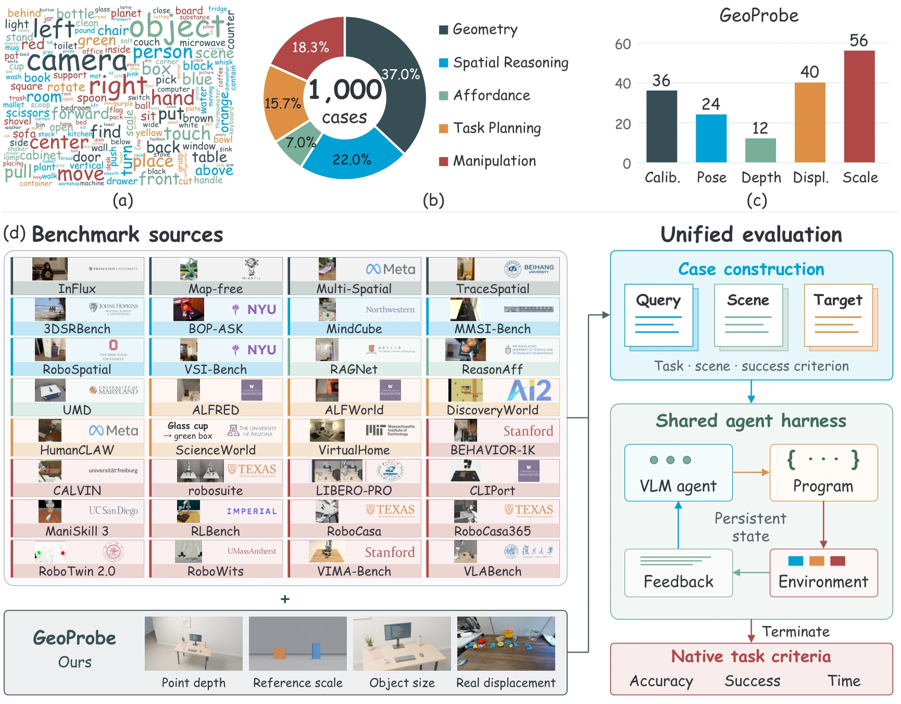

<h1 align="center">
  &nbsp; Embodied Agent Arena
</h1>

<h3 align="center">
  Are Frontier VLM Agents Ready to Be Robot Generalists?<br>
  <em>An Empirical Study with the Embodied Agent Arena</em>
</h3>

<p align="center">
  <a href="https://embodied-agent-arena.github.io/embodied-agent-arena/"></a>
  &nbsp;
  <a href="https://embodied-agent-arena.github.io/embodied-agent-arena/paper.pdf"></a>
  &nbsp;
  <a href="https://huggingface.co/datasets/uuu-Quant/Embodied-Agent-Arena"></a>
</p>

<div align="center">

<p>
Haojian Huang<sup>1,3</sup> · Pukun Zhao<sup>3</sup> · Zexi Li<sup>2,3</sup> · Yehang Zhang<sup>1,3</sup> · Yangkai Wei<sup>3</sup><br>
Wenqian Li<sup>3</sup> · Han Yang<sup>3</sup> · Kaiwen Zhou<sup>3</sup> · Ying-Cong Chen<sup>1,3,†</sup> · Yinchuan Li<sup>3,†</sup>
</p>

<p><sup>1</sup> HKUST (GZ) &nbsp; <sup>2</sup> The Chinese University of Hong Kong &nbsp; <sup>3</sup> Knowin AI<br>
<sup>†</sup> Corresponding authors</p>

</div>

---

## Overview

Embodied Agent Arena compares **GPT-6 Astra, GPT-6 Sol, Claude Fable 5.1, Gemini 3.8 Flash, Qwen 3.8 Max, Qwen 3.5 397B-A17B, and Qwen 3.5 27B** on **1,000 cases across five robotic capabilities**: Geometry, Spatial Reasoning, Affordance, Task Planning, and Manipulation. It combines 32 established sources with **GeoProbe**, our 168-case geometric-estimation benchmark. A minimal harness retains source-native observations and helpers while leaving perception, reasoning, and action selection to the model.

### Cross-Model Results

<!-- BEGIN RESULT_TABLE -->
| Model | Rot.&nbsp;↓ | Trans.&nbsp;↓ | Spatial&nbsp;↑ | AbsRel&nbsp;↓ | Mask&nbsp;↑ | Contact&nbsp;↑ | Plan&nbsp;↑ | Manip.&nbsp;↑ |
| :--- | ---: | ---: | ---: | ---: | ---: | ---: | ---: | ---: |
| GPT&#8209;6&nbsp;Astra | **17.1** | **106.6** | **69.4** | 0.213 | **0.286** | **60.3** | **80.3** | **41.8** |
| GPT&#8209;6&nbsp;Sol | 27.0 | 151.9 | 60.7 | 0.273 | 0.264 | 52.0 | 44.6 | 19.8 |
| Claude&nbsp;Fable&nbsp;5.1 | 25.2 | 121.7 | 62.0 | 0.186 | 0.284 | 57.1 | 63.7 | 24.7 |
| Qwen&nbsp;3.8&nbsp;Max | 20.5 | 138.1 | 68.9 | 0.205 | 0.272 | 52.9 | 35.7 | 9.3 |
| Gemini&nbsp;3.8&nbsp;Flash | 24.2 | 140.9 | 65.4 | **0.161** | 0.250 | 44.6 | 48.4 | 18.7 |
| Qwen&nbsp;3.5&nbsp;397B&#8209;A17B | 38.4 | 249.8 | 50.6 | 0.251 | 0.116 | 32.6 | 17.8 | 9.9 |
| Qwen&nbsp;3.5&nbsp;27B | 38.4 | 213.7 | 48.0 | 0.288 | 0.013 | 6.3 | 19.1 | 11.0 |
<!-- END RESULT_TABLE -->

Mean scores from [Table 2](https://embodied-agent-arena.github.io/embodied-agent-arena/paper.pdf#page=7); **bold** marks the best result.

[Full Results & Evaluation Settings](https://embodied-agent-arena.github.io/embodied-agent-arena/#results) · [Results CSV](public/data/model-comparison.csv)





## News

- **2026.10.05** — Published the [seven-model comparison](#cross-model-results), downloadable results, and a [model selection and evaluation guide](https://embodied-agent-arena.github.io/embodied-agent-arena/model-guide.html).

- **2026.10.05** — The [updated manuscript](https://embodied-agent-arena.github.io/embodied-agent-arena/paper.pdf) is available; the arXiv v2 replacement has been submitted and is awaiting announcement.

- **2026.10.03** — Added a visual [overview](#overview) of task planning and manipulation.
- **2026.10.01** — The [paper](https://embodied-agent-arena.github.io/embodied-agent-arena/paper.pdf) and [project page](https://embodied-agent-arena.github.io/embodied-agent-arena/) are available. The manuscript has been submitted to arXiv.
- **2026.10.01** — Released the [evaluation harness](#quick-start), multi-model batch runner, and [1,000-case dataset](https://huggingface.co/datasets/uuu-Quant/Embodied-Agent-Arena).

## Milestones

- [x] **Paper and project page** — Study, results, and case studies.
- [x] **Evaluation code** — Agent harness, benchmark adapters, scoring, and installation guides.
- [x] **Benchmark data** — 1,000-case dataset with a pinned download revision.
- [ ] **Reproduction reports** — Per-model evaluation outputs and consolidated analysis reports.
- [ ] **Analysis tools** — Scripts for aggregating results and reproducing the paper's figures.

## 📦 Benchmark

**GeoProbe** evaluates camera motion, object displacement, depth, and scale. Controlled Blender scenes isolate these geometric factors; real images extend the evaluation to natural scenes.

| Capability | Cases | What the agent must do |
| :--- | ---: | :--- |
| **Geometry** | 370 | Estimate camera parameters, depth, motion, and scale; trace spatial paths. |
| **Spatial Reasoning** | 220 | Relate objects and viewpoints, compare distances, and reason about scene layout. |
| **Task Planning** | 157 | Coordinate actions and feedback to satisfy household and scientific goals. |
| **Manipulation** | 183 | Execute placement, insertion, articulation, and sequential control tasks. |
| **Affordance** | 70 | Locate usable contacts and functional regions for an intended action. |

## Quick Start

### 1. Install

Use Linux and Python 3.10 or newer. From the repository root:

```bash
python3 -m venv .venv
source .venv/bin/activate
python -m pip install -e '.[offline,test,hub]'
```

For Task Planning and Manipulation, also follow the [interactive environment installation guide](docs/INSTALL.md) for the benchmarks you want to run.

### 2. Download the dataset

Download the [Hugging Face dataset](https://huggingface.co/datasets/uuu-Quant/Embodied-Agent-Arena) at its fixed release revision and validate it:

```bash
python scripts/fetch_data.py \
  --repo-id uuu-Quant/Embodied-Agent-Arena \
  --revision 5f729375eb35163a024625dd8ea72ac57a427a24 \
  --output ../data
arena validate --data-root ../data --hashes
arena list --data-root ../data
```

### 3. Run an evaluation

Copy [.env.example](.env.example) to `.env` and fill in your credentials. Replace `MODEL_ID` with your API model ID:

```bash
arena run --data-root ../data --benchmark w1_vlm_depth -- \
  --provider openai-compatible --model MODEL_ID --env-file .env \
  --workers 1 --retry-http --max-http-rounds 3 --output-dir outputs/evaluation
```

Select tasks with `--wave`, `--benchmark`, or `--case`. Add `--dry-run` to inspect the plan; repeat the command to resume its checkpoint. GPU environments require device and memory settings described in the [installation guide](docs/INSTALL.md).

For **multiple models**, edit [configs/batch.example.json](configs/batch.example.json), then run:

```bash
arena batch --config configs/batch.example.json --output-dir outputs/batch --execute
```

To **score saved offline predictions**, provide JSONL records with `task_id` and `answer` fields:

```bash
arena score --data-root ../data --benchmark w5_umd \
  --predictions predictions.jsonl --output outputs/scores.jsonl
```

## 📖 Citation

If this work is useful for your research, please cite:

<!-- BEGIN CITATION -->
```bibtex
@misc{huang2026embodiedagentarena,
  title = {Are Frontier VLM Agents Ready to Be Robot Generalists? An Empirical Study with the Embodied Agent Arena},
  author = {Huang, Haojian and Zhao, Pukun and Li, Zexi and Zhang, Yehang and Wei, Yangkai and Li, Wenqian and Yang, Han and Zhou, Kaiwen and Chen, Ying-Cong and Li, Yinchuan},
  year = {2026},
  eprint = {2610.00854},
  archivePrefix = {arXiv},
  primaryClass = {cs.RO},
  url = {https://arxiv.org/abs/2610.00854}
}
```
<!-- END CITATION -->
