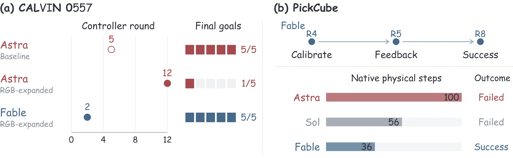

<div align="center">

<h1> Embodied Agent Arena</h1>

<h3>Are Frontier VLM Agents Ready to Be Robot Generalists?<br><em>An Empirical Study with the Embodied Agent Arena</em></h3>

<p>
  <a href="https://embodied-agent-arena.haojianhuang927.workers.dev/"></a>
  <a href="https://embodied-agent-arena.haojianhuang927.workers.dev/paper.pdf"></a>
  <a href="https://openreview.net/forum?id=T0b4fgyHFg"></a>
</p>

<p>
Haojian Huang<sup>1,3</sup> · Pukun Zhao<sup>3</sup> · Zexi Li<sup>2</sup> · Yehang Zhang<sup>1,3</sup> · Yangkai Wei<sup>3</sup><br>
Wenqian Li<sup>2</sup> · Han Yang<sup>3</sup> · Kaiwen Zhou<sup>3</sup> · Ying-Cong Chen<sup>1</sup> · Yinchuan Li<sup>3</sup>
</p>

<p><sup>1</sup> HKUST (Guangzhou) &nbsp; <sup>2</sup> The Chinese University of Hong Kong &nbsp; <sup>3</sup> Knowin AI</p>

<p><strong>1,000 cases &nbsp; · &nbsp; 32 sources + GeoProbe &nbsp; · &nbsp; 5 capabilities &nbsp; · &nbsp; 7 agents</strong></p>

[Overview](#overview) · [GeoProbe](#geoprobe) · [Key Findings](#key-findings) · [Citation](#citation)

</div>

---

<a id="overview"></a>

## 🤖 Overview

**Strong local skills do not yet add up to dependable robot generalism.** Embodied Agent Arena evaluates frontier vision-language agents across perception, reasoning, and action, asking whether accurate estimates and useful intermediate actions translate into complete robotic tasks.

Our **1,000-case arena** combines 32 established sources with **GeoProbe**, a new 168-case geometric-estimation benchmark. A unified agent harness connects model-generated programs to source environments, while task-level analyses reveal where Astra leads and where its advantages break down.

<p align="center">
  <a href="https://embodied-agent-arena.haojianhuang927.workers.dev/#arena"></a>
</p>

| Capability | What the agent must do |
| :--- | :--- |
| **Geometry** | Estimate camera parameters, depth, motion, and scale; trace spatial paths. |
| **Spatial Reasoning** | Relate objects and viewpoints, compare distances, and reason about scene layout. |
| **Affordance** | Locate usable contacts and functional regions for an intended action. |
| **Task Planning** | Coordinate actions and feedback to satisfy household and scientific goals. |
| **Manipulation** | Execute placement, insertion, articulation, and sequential control tasks. |

<a id="geoprobe"></a>

## 🔎 Introducing GeoProbe

**Can an agent separate object motion from camera motion?** GeoProbe adds 168 cases that probe camera motion, object displacement, depth, and scale. Controlled Blender scenes isolate these geometric factors; real images extend the evaluation to natural scenes.

<details>
<summary><strong>Explore the arena construction and GeoProbe targets</strong></summary>

<p align="center"></p>

</details>

<a id="key-findings"></a>

## 📊 Key Findings

- **Astra's advantages span estimation, contact grounding, and planning.** It has the lowest error on all five controlled Blender estimation targets, leads valid-contact prediction on UMD and ReasonAff, and leads or ties the best model across all six planning sources.
- **Spatial competence depends on the reference frame.** Astra excels at connecting views, while inferring camera movement and object-facing directions exposes different weaknesses.
- **Progress is not completion.** Accurate traces and longer action sequences can still miss required endpoints or final goals. Household manipulation additionally demands coordinated navigation, object handling, and environment-state changes.

**[Compare all seven agents →](https://embodied-agent-arena.haojianhuang927.workers.dev/#results)** &nbsp; · &nbsp; **[Explore task-level findings →](https://embodied-agent-arena.haojianhuang927.workers.dev/#findings)**

<details>
<summary><strong>Case study: when agents establish feedback control</strong></summary>

In CALVIN sequence 0557, baseline Astra establishes feedback control at round 5, RGB-expanded Astra at round 12, and Fable under RGB-expanded execution at round 2. The recorded actions connect task outcomes to how agents turn observations into reusable control.

<p align="center"></p>

[More recorded cases on the project page →](https://embodied-agent-arena.haojianhuang927.workers.dev/#cases)

</details>

<a id="citation"></a>

## 📖 Citation

If this work is useful for your research, please cite:

```bibtex
@misc{huang2026embodiedagentarena,
  title  = {Are Frontier VLM Agents Ready to Be Robot Generalists?
            An Empirical Study with the Embodied Agent Arena},
  author = {Huang, Haojian and Zhao, Pukun and Li, Zexi and Zhang, Yehang
            and Wei, Yangkai and Li, Wenqian and Yang, Han and Zhou, Kaiwen
            and Chen, Ying-Cong and Li, Yinchuan},
  year   = {2026},
  url    = {https://github.com/embodied-agent-arena/embodied-agent-arena}
}
```

## 🛠️ Project Page Development

<details>
<summary><strong>Preview, edit, and deploy the website</strong></summary>

The static website is in [`public/`](public/). Its layout, styles, and interactive results live in `index.html`, `styles.css`, and `app.js`; figures are in [`public/assets/`](public/assets/).

From the repository root, download the current paper and start a local preview:

```sh
curl -L https://embodied-agent-arena.haojianhuang927.workers.dev/paper.pdf -o public/paper.pdf
python3 -m http.server 8000 --directory public
```

Open `http://localhost:8000`. With Cloudflare Wrangler installed and authenticated, deploy using the included [`wrangler.jsonc`](wrangler.jsonc):

```sh
npx wrangler deploy
```

</details>
